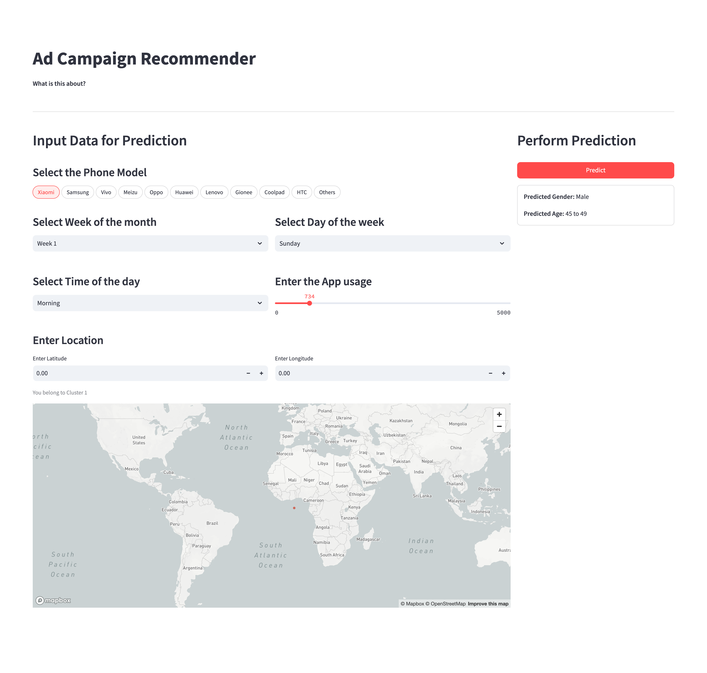

# Ad Campaign Recommender Capstone Project

A machine learning-based application that predicts user demographics (age and gender) based on mobile phone usage patterns and recommends personalized ad campaigns.

## Table of Contents
- [Project Overview](#project-overview)
- [Features](#features)
- [Getting Started](#getting-started)
- [Setup](#setup)
- [Usage](#usage)
- [Models Used in Inference](#models-used-in-inference)
- [Deployment](#deployment)

---

## Project Overview

This project is part of a capstone initiative focused on leveraging predictive analytics in the telecom sector. The application aims to:

1. Predict user demographics (age and gender) based on mobile phone usage patterns.
2. Recommend personalized ad campaigns tailored to specific customer segments.

The solution combines machine learning, geospatial analysis, and interactive user interfaces to achieve these goals.

---

## Features

### Key Features of the Application
- **Demographics Prediction**:
  - Predicts age group (e.g., <20, 20-24, 25-32, etc.) using regression or classification models.
  - Predicts gender (Male/Female) using binary classification.

- **Personalized Campaign Recommendations**:
  - Maps predicted demographics to targeted marketing campaigns.
  - Supports 6 campaign types based on age and gender.

- **Geospatial Analysis**:
  - Integrates latitude and longitude data for location-based clustering.
  - Uses DBSCAN algorithm for geospatial feature generation.

- **Interactive UI**:
  - Streamlit-powered web interface for inputting mobile phone usage data.
  - Real-time predictions and visualizations.

---

## Getting Started

### Prerequisites
- Docker installed on your system (for containerization).
- Python 3.9 or later.
- Basic understanding of machine learning concepts.

### Installation Steps
1. Clone the repository:
   ```bash
   git clone https://github.com/yourusername/ad-campaign-recommender.git
   cd ad-campaign-recommender
   ```

2. Install dependencies:
   ```bash
   pip install -r requirements.txt
   ```

---

## Setup

### Running the Application Locally
1. Build the Docker image:
   ```bash
   docker build -t ad-campaign-recommender .
   ```

2. Run the application in a Docker container:
   ```bash
   docker run -p 8501:8501 ad-campaign-recommender
   ```

The application will be accessible at `http://localhost:8501`.

---

## Usage

### Accessing the Application
1. Open the web interface at `http://localhost:8501` or on your cloud deployment URL.
2. Provide input data:
   - Phone model (e.g., Xiaomi, Samsung).
   - Week of the month (Week 1-5).
   - Day of the week (Sunday-Saturday).
   - Time of day (Morning, Afternoon, Evening, Night).
   - App usage count.
   - Latitude and longitude for geospatial analysis.

3. Click the "Predict" button to receive predictions:
   - Predicted gender (Male/Female).
   - Predicted age group.
   - Geospatial clustering results.

### Example Output
- **Predicted Gender**: Female/Male
- **Predicted Age Group**: Less than 20, 20-24, etc.
- **Geospatial Clustering**: Assigned cluster based on location data.

---

## Models Used in Inference

### Gender Prediction Model
- Type: Binary classification (XGBoost).
- Input features:
  - Phone brand category.
  - Geospatial clusters.
  - Day of the week.
  - Time of day.
  - App usage count.

### Age Group Prediction Model
- Type: Multiclass classification/regression (Random Forest).
- Input features:
  - Similar to gender model, with additional geospatial data.
  - Latitude and longitude for clustering.

---

## Deployment

### Running on AWS EC2
1. Launch an EC2 instance with Docker installed.
2. Copy the Docker image to your S3 bucket.
3. Run the application on the EC2 instance:
   ```bash
   docker run -p 8501:8501 ad-campaign-recommender
   ```
4. Expose port 8501 to allow external access.

### Monitoring and Scaling
- Use CloudWatch (AWS) or Prometheus for monitoring.
- Scale horizontally by launching additional EC2 instances during peak load.

---

## Conclusion

This project demonstrates the power of predictive analytics in enhancing marketing strategies through personalized ad campaigns. The application leverages cutting-edge machine learning techniques, geospatial analysis, and interactive UI to deliver actionable insights.

For more details or to contribute to the project, feel free to reach out!

---
